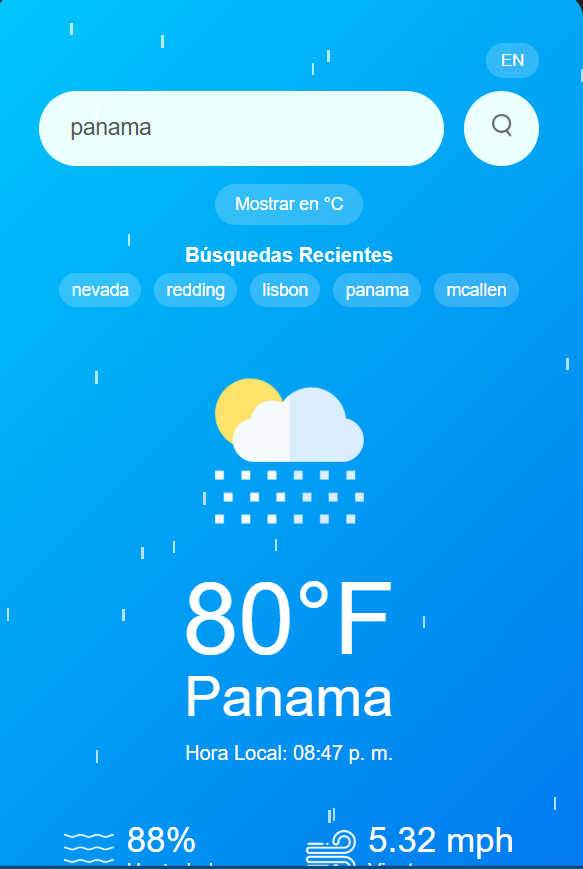
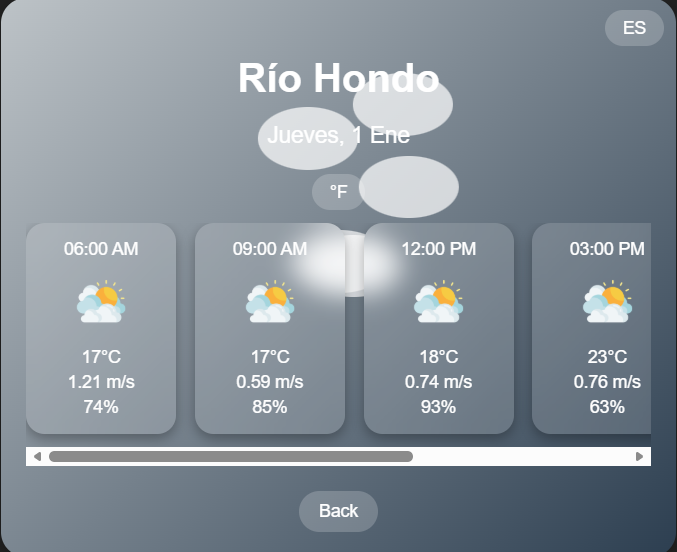

# WeatherPulse 🌦️

WeatherPulse is a responsive and interactive weather web app that lets users check the current weather, a 5-day forecast, and an hourly forecast for any city. It uses the OpenWeatherMap API to fetch live weather data and displays it in a clean, modern interface with dynamic animations.

## Features

- Current weather: temperature, humidity, wind speed, and weather icon.
- 5-day forecast with max/min temperatures, weather icons, and clickable cards to view hourly forecasts.
- Hourly forecast page for each day showing temperature, wind, humidity, and weather icons for 8-hour intervals.
- Dynamic local time display with language toggle (English / Spanish).
- Interactive weather animations: sun, moon, clouds, and rain.
- Search history with quick access to recent cities.
- Responsive, modern design with hover effects and smooth transitions.
- Error handling for invalid city names.
- Built with HTML, CSS, and JavaScript using OpenWeatherMap API.

## Screenshots

 

 

## Demo
<video controls src="screenshots/Recording 2026-01-01 215032.mp4" title="Title"></video>

## Installation

1. Clone the repository:

    git clone https://github.com/yourusername/weatherpulse.git

2. Open index.html in your browser.

3. Make sure all files are in the same folder:

   - `index.html`
   - `hourly.html`
   - `script.js`
   - `hourly.js`
   - `style.css`
   - `hourly.css`
   - `lang.json`
   - `images/` directory (contains weather icons)

## Usage
- Enter a city name in the search box and click the search button or press Enter.
- The app will display the current weather and the 5-day forecast.
- Click on any day’s forecast card to view the hourly forecast for that day.
- Switch languages between English and Spanish using the language toggle button.
- Toggle between Fahrenheit and Celsius units using the unit toggle button.
- Recent searches are saved and can be clicked to quickly view weather for those cities.
- If the city is not found, an error message is displayed.

## Technologies Used
* HTML5
* CSS3
* JavaScript
* OpenWeatherMap API